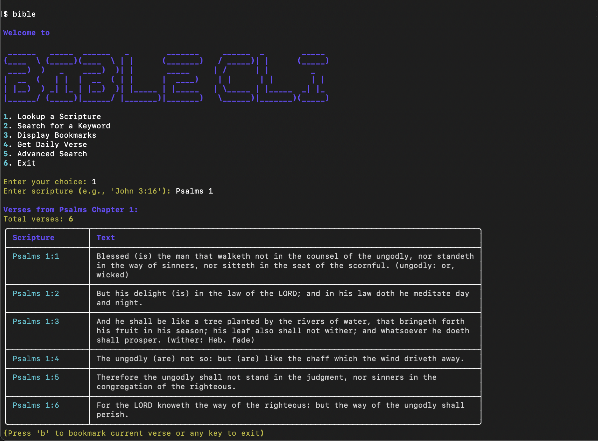
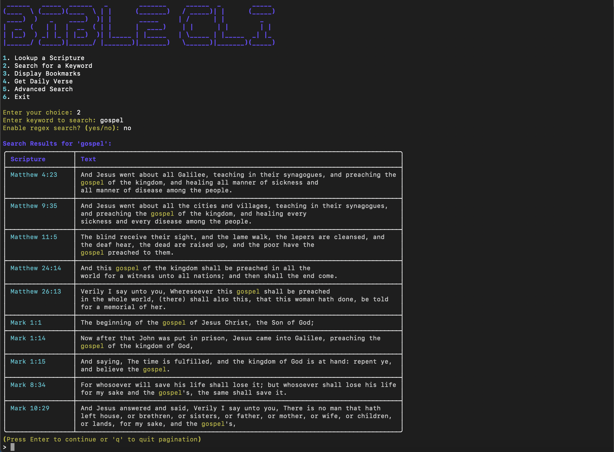
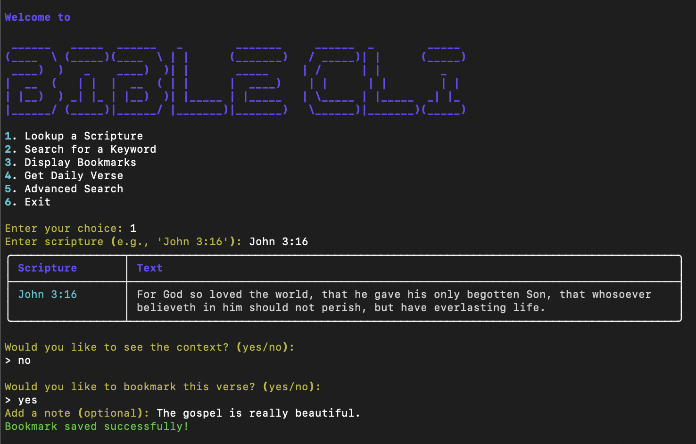
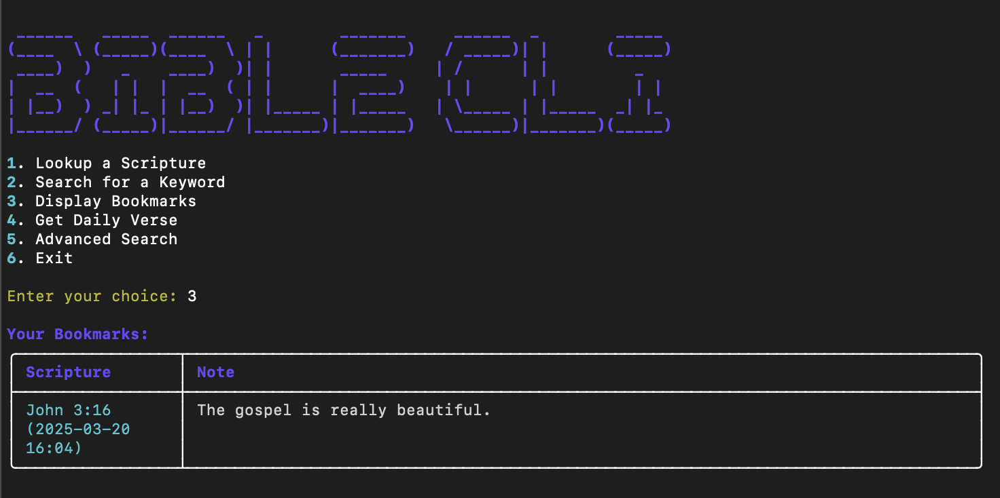

# Bible CLI

A command-line interface for reading and searching the Bible woth beautiful formatting to keep you in the Word everyday.

## Demo

### Scripture Lookup

*Look up verses with beautiful formatting*

### Search Functionality

*Search across the Bible with advanced filters*

### Bookmarks


*Save your favorite verses with a comment on your thoughts*

### Daily Verse

*Get daily inspiration*

## Features

- Look up specific verses by book, chapter, and verse
- Search for keywords or phrases across all books
- Advanced search with filters (testament, word count, regex)
- Daily verse feature
- Bookmark favorite verses with notes
- Beautiful terminal interface with Rich
- Fuzzy matching for book names
- Pagination for long chapters and search results
- Context view for verses

## Installation

Install directly from PyPI:

```bash
pip install bible-cli
```

## Usage

### Interactive Mode
```bash
bible
```

### Command Line Arguments
```bash
# Look up a specific verse
bible "John 3:16"

# Search for a keyword
bible -s "love"

# Advanced search with options
bible -s "faith" --testament new --min-words 10 --max-words 20 --regex
```

## Features in Detail

### Scripture Lookup
- Look up by book only (e.g., "Genesis")
- Look up by book and chapter (e.g., "Genesis 1")
- Look up by book, chapter, and verse (e.g., "John 3:16")
- Look up verse ranges (e.g., "John 3:16-18")

### Search Features
- Case-insensitive search
- Regular expression support
- Filter by testament (Old/New)
- Filter by word count
- Paginated results

### Bookmarks
- Save favorite verses
- Add notes to bookmarks
- View all bookmarks with timestamps

## Development

If you want to contribute to the project or run it from source:

1. Clone the repository:
```bash
git clone https://github.com/wisyhambolu/Bible-Cli.git
cd Bible-Cli
```

2. Install development dependencies:
```bash
pip install -r requirements.txt
```

3. Run the development version:
```bash
python -m bible_cli
```

## Contributing

Contributions are welcome! Please feel free to submit a Pull Request. For major changes, please open an issue first to discuss what you would like to change.

1. Fork the repository
2. Create your feature branch (`git checkout -b feature/AmazingFeature`)
3. Commit your changes (`git commit -m 'Add some AmazingFeature'`)
4. Push to the branch (`git push origin feature/AmazingFeature`)
5. Open a Pull Request

## Support the Project

If you find this project helpful, consider buying me a coffee! Your support helps me maintain and improve this project.

[](https://buymeacoffee.com/wisyhambolu)

## License

This project is licensed under the MIT License - see the [LICENSE](LICENSE) file for details.

## Author

Created by Wisdom Hambolu

## Acknowledgments

- Rich library for beautiful terminal output
- RapidFuzz for fuzzy matching
